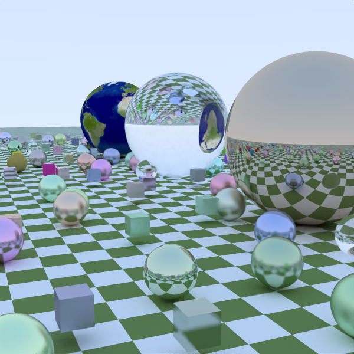

# Raytrace In A Weekend

## In Kotlin

This is a pretty direct translation of https://github.com/petershirley/raytracinginoneweekend into kotlin.

Any bugs are my own.

Please feel free to copy / change / fork / raise issues as you see fit.

## Example

The below example is rendered with 2 samples/pixel, then loaded into Intel Open Image Denoise,
and renders in 0.3 seconds.

### Notes about the code

- Uses Intel Open Image Denoise (oidn) Library to improve quality of scenes (via https://github.com/time4tea/oidnjni)
- Uses Kotlin Co-routines for rendering in parallel, seems fairly effective
- Uses Kotlin-Scripting for allowing dynamically-reloading scenes that can be edited while the code is running
- Has an interactive mode: use Cursor-Keys, +/- to move camera, and 1/2 to dec/inc number of samples

### Changes from "Raytrace In a Weekend"
- Some stylistic changes for Kotlin (e.g. Hitable -> Hit? )
- Most things immutable, e.g. colours are the sum of the samples, not modified in place
- Uses x,y,z rather than an array for `Vec3`
- Added Triangle Primitive
- Added `.obj` file loading (poorly)
- Used BVH for Box

### Main Programs

- Raytrace.kt - render a scene
- ControllableRaytrace.kt - render a scene and move around it
- DynamicRaytrace.kt - render a scene, which can be modified while program is running

